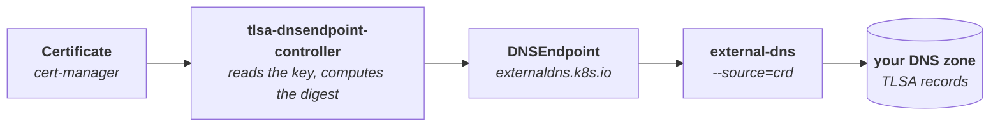

# tlsa-dnsendpoint-controller

Publishes TLSA (DANE, RFC 6698) records for cert-manager Certificates by writing
external-dns `DNSEndpoint` resources.

This is the division of labour that neither project does alone: cert-manager owns
the certificate lifecycle but has no way to write DNS records outside ACME
challenges, and external-dns owns ~50 DNS providers but cannot derive a record's
contents from certificate material. This controller sits between them.



You annotate a Certificate; TLSA records appear in DNS and stay correct across
renewals, including the window where the key changes.

> **Requires external-dns v0.23.0 or newer.** TLSA support landed in
> [external-dns#6616](https://github.com/kubernetes-sigs/external-dns/pull/6616).
> Earlier versions cannot read TLSA records back, and on Cloudflare cannot write
> them at all. See [Supported versions](#supported-versions).

## Quickstart

```bash
# 1. Check for the DNSEndpoint CRD. The official external-dns Helm chart
#    installs it for you; other install methods often do not.
kubectl get crd dnsendpoints.externaldns.k8s.io

# 2. Only if that came back NotFound:
kubectl apply -f https://raw.githubusercontent.com/kubernetes-sigs/external-dns/master/config/crd/standard/dnsendpoints.externaldns.k8s.io.yaml

# 3. This controller.
helm install tlsa oci://ghcr.io/oscrx/charts/tlsa-dnsendpoint-controller \
  --version 0.2.4 \
  --namespace cert-manager
```

external-dns must be running with `--source=crd` **and**
`--managed-record-types=TLSA`. The default managed set is A/AAAA/CNAME only, so
without that flag your records are silently ignored.

Then annotate a Certificate:

```yaml
metadata:
  annotations:
    tlsa.oscarr.nl/enabled: "true"
    tlsa.oscarr.nl/ports: "25,465,587"
```

And check what landed:

```bash
kubectl get dnsendpoint mail-tlsa -o yaml
dig +dnssec TLSA _25._tcp.mail.example.com
```

If nothing appears, start at [Troubleshooting](#troubleshooting).

## What it does

For a Certificate that opts in via annotations, it maintains a single
`DNSEndpoint` named `<certificate-name>-tlsa` in the same namespace, holding one
TLSA record per (DNS name × port).

The `DNSEndpoint` carries an owner reference to the Certificate. That is a
deliberate design choice: **no finalizer is involved anywhere**, so deleting a
Certificate can never block on DNS being reachable — Kubernetes garbage
collection removes the `DNSEndpoint`, and external-dns withdraws the records on
its next sync.

Related upstream discussion: [cert-manager#6472](https://github.com/cert-manager/cert-manager/issues/6472).

## Renewal safety

Naively replacing a TLSA record when a certificate is renewed breaks DANE. RFC
7671 section 8.1 requires the new record to be published *before* the new
certificate is served, and both to coexist during the changeover. This matters
more than it used to: cert-manager's `privateKey.rotationPolicy` now defaults to
`Always`, so the key — and therefore the SPKI digest — changes on **every**
renewal.

This controller handles both ends of the window:

**Before issuance — pre-publication.** cert-manager writes the next private key
to its own Secret and sets `status.nextPrivateKeySecretName` *before* it requests
the new certificate. With the default `SPKI` selector, the record data depends
only on the public key, so the digest for the not-yet-issued certificate is
already knowable. This controller reads that key and publishes its record
alongside the current one, so by the time the new certificate is served, a
matching TLSA record has already been in DNS for the whole issuance round trip.

This is impossible with `selector: FullCert`, where the digest covers fields the
CA fills in at signing time. That is the main reason to stay on `SPKI`.

**After issuance — retirement.** The superseded digest stays published for
`--rollover-grace` (default 168h) rather than being deleted immediately. The
controller cannot observe when your server actually stops presenting the old
certificate — that depends on whether the workload reloads, and when. Publishing
an extra TLSA record is harmless: DANE succeeds if *any* record matches.
Removing one too early is what breaks validation. So the default errs long.
Retirement state is tracked in an annotation on the `DNSEndpoint`.

## Supported versions

| Component | Required | Notes |
|---|---|---|
| Kubernetes | ≥ 1.25 | The chart declares `kubeVersion: ">=1.25.0-0"`. |
| cert-manager | any recent release | Uses the `cert-manager.io/v1` `Certificate` API. |
| external-dns | **≥ v0.23.0** | TLSA support landed in [#6616](https://github.com/kubernetes-sigs/external-dns/pull/6616). Must run `--source=crd --managed-record-types=TLSA`. See [Provider support](#provider-support). |
| `DNSEndpoint` CRD | `externaldns.k8s.io/v1alpha1` | The official external-dns Helm chart installs it automatically. Other install methods may not — check with `kubectl get crd dnsendpoints.externaldns.k8s.io`. |

DNSSEC must be enabled on the zone. Without it, DANE authenticates nothing —
and nothing here checks that for you.

## Provider support

TLSA reached external-dns in
[#6616](https://github.com/kubernetes-sigs/external-dns/pull/6616), released in
**v0.23.0** — but that fix is narrower than "external-dns supports TLSA now".
The shared read filter in `provider/recordfilter.go` still allows only
`A, AAAA, CNAME, DNAME, SRV, TXT, NS`. Cloudflare works because it overrides
that filter for itself. Any provider using the shared filter unchanged still
drops TLSA records when reading the zone back.

| Provider | TLSA on v0.23.0 | Why |
|---|---|---|
| **Cloudflare** | **Works** — verified end to end | Overrides the shared filter, and #6616 added its structured write path |
| **PowerDNS** | **Should work** — untested | Passes the record type through as an opaque string on read and write, with no allowlist |
| **Webhook providers** | Depends on the provider | external-dns applies no type filter of its own; behaviour is entirely the out-of-tree provider's |
| **rfc2136** | Not yet | Writes succeed via `dns.NewRR`, but its own read switch silently drops any type it does not name |
| Route53, Azure, Google Cloud DNS, Alibaba Cloud, Civo, DNSimple, GoDaddy, Linode, NS1, OCI, OVH, Scaleway | Not yet | Use the shared filter. Several add MX or NAPTR for themselves; none add TLSA |
| CoreDNS, Pi-hole, Exoscale | Not yet | Handle a small fixed set of types in their own code, roughly A/AAAA/CNAME/TXT |
| AWS Cloud Map | No | Service discovery rather than a DNS zone API; TLSA has no representation there |

"Not yet" means the blocker is external-dns's own code, not the protocol —
nothing about these providers makes TLSA impossible, and adding one is usually
small. Cloudflare needed a structured write path because its API models TLSA as
fields rather than a string; a provider that already passes record types through
opaquely may need nothing beyond the filter entry.

Records are still *created* on those providers — what fails is reading them
back. external-dns then sees no existing state, so it re-creates on every sync
and never updates or deletes.

One caveat on "not yet": the DNS service has to support TLSA too. Route53 and
Azure DNS do not offer the record type at all, so no amount of external-dns work
would help there. Check your provider's supported types before filing an issue
against external-dns.

Cloudflare has been verified end to end against the live API with a cert-manager
certificate: one `CREATE`, no churn on subsequent syncs, and a DANE client
validating the endpoint.

```sh
$ openssl s_client -connect oscarr.nl:443 -dane_tlsa_domain oscarr.nl \
    -dane_tlsa_rrdata "3 1 1 54ee30e7...caa15e15820f"
Verification: OK
DANE TLSA 3 1 1 ...207258072299caa15e15820f matched the EE certificate at depth 0
Verify return code: 0 (ok)
```

That is the check to run against your own endpoint. `-dane_tlsa_rrdata` takes
the record data exactly as published, and a match at depth 0 means a DANE client
would accept the certificate your server actually serves. For a mail host, add
`-starttls smtp` and use port 25.

### Cloudflare: proxied records make DANE meaningless

This one is independent of external-dns, and no patch changes it. If the A/AAAA
record for the name is proxied — the orange cloud — clients complete TLS with
**Cloudflare's edge certificate**, not your origin's. A `DANE-EE` record pinning
your cert-manager certificate would then never match what a client actually sees,
and DANE validation fails for everyone who checks.

- **SMTP (25, 465, 587): fine.** Cloudflare does not proxy SMTP; those names are
  DNS-only and clients reach your MTA directly. This is the case DANE is mostly
  deployed for, and the one this controller is most useful for.
- **HTTPS behind the proxy: do not do this.** Turn the proxy off for that name,
  or do not publish TLSA records for it.

Separately, external-dns omits TLSA from `recordTypeProxyNotSupported`, so with
`--cloudflare-proxied` it will try to create TLSA records with `proxied=true` and
Cloudflare will reject them. Work around it from this side, on any build:

```sh
--provider-specific=external-dns.kubernetes.io/cloudflare-proxied=false
```

(Match external-dns's own `--annotation-prefix` if you have changed it.)

<details>
<summary><b>Why external-dns before v0.23.0 drops TLSA — the detail</b></summary>

All of the following describes external-dns **before v0.23.0**. Useful if you
are stuck on an older version and diagnosing what you see.

**Reads are filtered.** `provider/recordfilter.go` allows only
`A, AAAA, CNAME, DNAME, SRV, TXT, NS`. Providers filter reads through it, so
TLSA records are dropped on the way back in. Without reads, external-dns sees no
existing state: it attempts a create on every sync and never updates or deletes
correctly. This is still true on v0.23.0 for every provider that uses the shared
filter — Cloudflare is exempt because it overrides it.

**Ownership did not round-trip (all providers).** Fixed globally in v0.23.0. external-dns's TXT registry
will create an ownership record for a TLSA endpoint but will not recognise it
again. `registry/mapper` writes the ownership TXT generically — `ToTXTName`
yields `tlsa-_443._tcp.example.com` with no changes needed. But the reverse
direction, `ToEndpointName` → `dropAffixExtractType` →
`extractRecordTypeDefaultPosition`, matches the leading token against a hardcoded
`supportedRecords` list that omits TLSA:

```txt
A     write=a-_443._tcp.example.com      read back  name="_443._tcp.example.com"      type="A"
SRV   write=srv-_443._tcp.example.com    read back  name="_443._tcp.example.com"      type="SRV"
TLSA  write=tlsa-_443._tcp.example.com   read back  name="tlsa-_443._tcp.example.com" type=""
```

The consequence is the failure mode described in
[external-dns#6180](https://github.com/kubernetes-sigs/external-dns/issues/6180):
records get created, external-dns never acknowledges ownership of them, and it
therefore never updates or deletes them — leaving the ownership TXT orphaned in
the zone forever. The fix is one line, adding TLSA to `supportedRecords` in
`registry/mapper/mapper.go`.

**Cloudflare needs a structured write path.** Cloudflare models TLSA like SRV:
`TLSARecordParam` in cloudflare-go has **no `Content` field at all**, only
`Data{Usage, Selector, MatchingType, Certificate}`, and the read-side `Content`
is documented as "Formatted TLSA content. See 'data' to set TLSA properties."
external-dns already special-cases exactly this for SRV, in
`buildSRVRecordParam` (batch path) and `getCreateDNSRecordParam` (single path);
#6616 adds a `buildTLSARecordParam` alongside them, parsing `"3 1 1 <hex>"` into
the four fields. Without it the write is attempted and Cloudflare answers:

```txt
400 Bad Request
  "usage is a required data field."
  "selector is a required data field."
  "matching_type is a required data field."
  "certificate is a required data field."
```

**Cloudflare record identity comes from `Content`.** `newDNSRecordIndex` keys
records on `endpointTargetFromCloudflareRecord`, which returns `record.Content`
for everything except SRV, where it re-renders from `Data`. TLSA needs the same
treatment. Cloudflare returns the record as `3 1 1 54EE30E7...CAA1 5E15820F` —
uppercase, with embedded whitespace — while external-dns writes lowercase and
contiguous. Without normalising reads back through the same parser, every sync
sees a difference and issues a redundant update forever.

#6616 implements all of the above, modelled on the SRV handling that already
solves the same problem: each `if type == SRV` becomes a `switch` with a TLSA
case. That shape matters beyond TLSA, because thirteen Cloudflare record types
are `data`-only on write (CAA, CERT, DNSKEY, DS, HTTPS, LOC, NAPTR, SMIMEA, SRV,
SSHFP, SVCB, TLSA, URI) and external-dns handles one of them today.

</details>

## Installation

### Helm (recommended)

The chart is published as an OCI artifact:

```bash
helm install tlsa oci://ghcr.io/oscrx/charts/tlsa-dnsendpoint-controller \
  --version 0.2.4 \
  --namespace cert-manager
```

See [charts/tlsa-dnsendpoint-controller](charts/tlsa-dnsendpoint-controller) for
the values. The chart refuses configurations that would misbehave at runtime —
more than one replica without leader election, an empty annotation prefix, a
ServiceMonitor without metrics — rather than letting you discover them from logs.

### Plain manifests

Without Helm:

```bash
kubectl apply -f deploy/rbac.yaml
kubectl apply -f deploy/deployment.yaml
```

These are the minimal equivalent of the chart's defaults, maintained by hand, so
prefer the chart if you want to change anything.

The Deployment references `ghcr.io/oscrx/tlsa-dnsendpoint-controller:0.2.4`,
published multi-arch and cosign-signed by the release workflow. To build locally:

```bash
go build -o tlsa-dnsendpoint-controller .
```

## Configuration

Annotations on the Certificate. Prefix is `tlsa.oscarr.nl` by default; change it
with `--annotation-prefix`.

| Annotation | Default | Meaning |
| --- | --- | --- |
| `enabled` | *(required)* | Must be `"true"`. Nothing happens without it. |
| `ports` | `443` | Comma-separated ports, e.g. `"25,465,587"`. |
| `protocol` | `tcp` | `tcp`, `udp` or `sctp`. |
| `usage` | `DANE-EE` | `PKIX-TA`, `PKIX-EE`, `DANE-TA`, `DANE-EE` (or `0`–`3`). |
| `selector` | `SPKI` | `SPKI` or `FullCert` (or `0`–`1`). |
| `matching-type` | `SHA256` | `SHA256` or `SHA512` (or `1`–`2`). |
| `ttl` | `300` | Record TTL in seconds. |
| `dns-names` | all of `spec.dnsNames` | Restrict which names get records. |

A malformed annotation value is never silently defaulted — the controller emits a
`TLSAConfigInvalid` warning event and publishes nothing, because a typo that
quietly published the wrong digest would be worse than publishing nothing.

Setting `enabled: "false"` after records exist deletes the `DNSEndpoint`,
withdrawing them.

### Flags

| Flag | Default | Meaning |
| --- | --- | --- |
| `--annotation-prefix` | `tlsa.oscarr.nl` | Annotation domain prefix. |
| `--provider-specific` | *(none)* | `key=value` passed to the external-dns provider on every record. Repeatable. See [Cloudflare](#cloudflare-proxied-records-make-dane-meaningless). |
| `--rollover-grace` | `168h` | How long a superseded record stays published. |
| `--resync-period` | `1h` | Full reconcile interval absent watch events. |
| `--namespace` | *(all)* | Restrict to one namespace. |
| `--leader-elect` | `false` | Needed only for multiple replicas. |
| `--metrics-bind-address` | `:8080` | `0` to disable. |
| `--health-probe-bind-address` | `:8081` | |

## Example

```yaml
apiVersion: cert-manager.io/v1
kind: Certificate
metadata:
  name: mail
  annotations:
    tlsa.oscarr.nl/enabled: "true"
    tlsa.oscarr.nl/ports: "25,465,587"
spec:
  secretName: mail-tls
  dnsNames: [mail.example.com]
  issuerRef:
    name: letsencrypt-prod
    kind: ClusterIssuer
```

Produces `_25._tcp.mail.example.com`, `_465._tcp.…` and `_587._tcp.…`, each
`TLSA 3 1 1 <sha256 of the SPKI>`. More in [examples/](examples/).

## Troubleshooting

| Symptom | Cause | Fix |
| --- | --- | --- |
| No `DNSEndpoint` is created | Certificate not opted in, or prefix mismatch | Set `<prefix>/enabled: "true"`; check `--annotation-prefix` matches the annotation you used |
| `DNSEndpoint` exists, but no DNS records | external-dns is ignoring TLSA | Add `--managed-record-types=TLSA` and `--source=crd` to external-dns |
| `400` — "usage is a required data field" | external-dns older than v0.23.0 cannot write TLSA on Cloudflare | Upgrade external-dns to v0.23.0 or later |
| Cloudflare rejects the create as proxied | TLSA missing from external-dns's non-proxyable list | `--provider-specific=external-dns.kubernetes.io/cloudflare-proxied=false` |
| external-dns updates the same record every sync | Reads are filtered, so it never sees existing state | Only Cloudflare and PowerDNS read TLSA back — see [Provider support](#provider-support) |
| Ownership TXT `tlsa-…` left orphaned; records never updated or deleted | Registry cannot round-trip the TLSA prefix | Upgrade external-dns to v0.23.0 or later |
| `TLSAConfigInvalid` warning event | Malformed annotation value | Fix the value; nothing is published until it parses |
| `TLSANameSkipped` warning event | Wildcard DNS name | Expected — use `dns-names` to select concrete names |
| `TLSADataUnavailable` warning event | `DANE-TA`/`PKIX-TA` with no intermediate in `tls.crt` or `ca.crt` | Use `DANE-EE`, or issue a chain that includes one |
| No events from the controller at all | RBAC missing the `events.k8s.io` group | Upgrade to 0.2.4 or later |
| Record resolves but DANE validation fails | Name is proxied (edge cert), or the zone is not DNSSEC-signed | Turn the proxy off for that name; add the DS record at your registrar |

## Behaviour notes

- **Wildcard names are skipped** with a `TLSANameSkipped` warning. DANE clients
  look up TLSA records under the concrete name they connected to, so a wildcard
  owner name would never be queried.
- **`DANE-TA`/`PKIX-TA`** use the intermediate from `tls.crt` when the chain has
  one (which is what RFC 7671 section 5.2.2 wants, since that is the certificate
  the peer presents), falling back to `ca.crt`. If neither exists, a
  `TLSADataUnavailable` warning is emitted and nothing is published.
- **`matchingType: Full`** is rejected. It embeds the entire certificate or SPKI
  in DNS, is discouraged by RFC 7671 section 6, and many providers reject the
  resulting rdata length.
- **A missing or unreadable Secret never withdraws existing records.** A
  transient read failure must not break DANE.
- **Record data is lowercase, contiguous hex** with no colons or wrapping, per
  RFC 6698 section 2.2. Some providers reject the alternatives.
- **Secrets are not cached.** They are read directly from the API server, so the
  controller needs only `get` on Secrets and never holds cluster secret material
  in memory. Renewals still reach the controller because cert-manager updates the
  Certificate's status when key material changes.

## Scope

Out of scope, deliberately: DNSSEC signing, SVCB/HTTPS records (RFC 9460),
verifying that published records actually resolve, and any DANE validation of
your own services. Records for names not covered by a cert-manager Certificate
belong in a hand-written `DNSEndpoint`.

## Development

```bash
make verify   # vet, lint and race-enabled tests — what CI runs
make test     # tests only
make lint     # golangci-lint
make build    # binary into build/
make image    # single-platform image for the host
```

CI runs the same checks on every push and pull request, plus a two-platform image
build to catch cross-compilation breakage. Images are published only from
`release.yaml`, on a `v*` tag or a manual dispatch: multi-arch, with provenance,
an SBOM, and a keyless cosign signature.

### Tests

The TLSA digests in `internal/tlsa/testdata` are asserted against values
computed independently with OpenSSL, so the tests are a genuine RFC 6698
conformance check rather than a restatement of the implementation. One test also
feeds the generated rdata through `miekg/dns` — the library external-dns
providers use to build resource records — to confirm the presentation format is
one those providers will accept.

## License

Apache 2.0. See [LICENSE](LICENSE).
